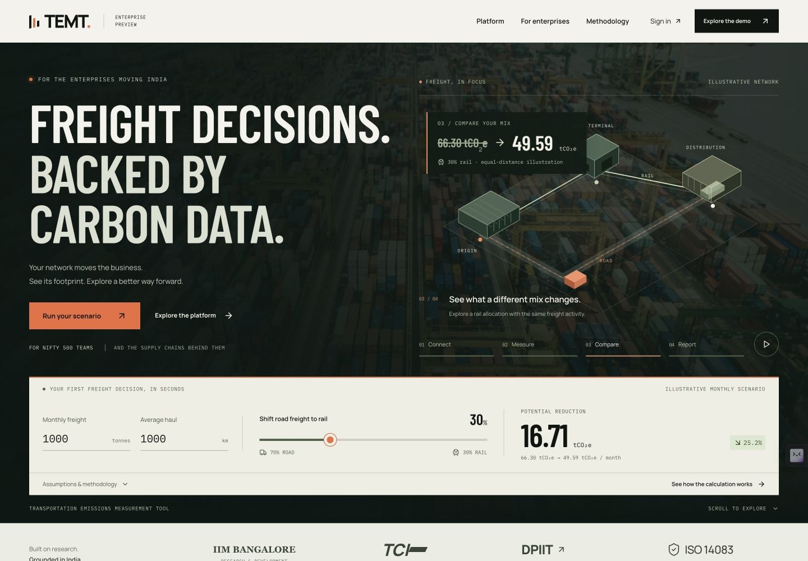

# TEMT enterprise preview

An authorized product preview for India's enterprise sustainability and supply-chain teams. The project pairs an interactive freight-emissions landing page with a real shipment-analysis API, transparent methodology, and downloadable reporting.

**[Live site](https://temt-iimb-sample.onrender.com) · [Interactive demo](https://temt-iimb-sample.onrender.com/demo/) · [Case study PDF](artifacts/deliverables/TEMT-Product-Case-Study.pdf) · [Editable DOCX](artifacts/deliverables/TEMT-Product-Case-Study.docx)**



## What works

- Four-chapter cinematic freight story, with pause controls, reduced-motion support and responsive SVG animation.
- Integrated hero calculator using published GLEC v3.2 factors. Its exact inputs continue into the working demo.
- Road, rail, ocean and air comparisons with explicit assumptions.
- Four explorable sector networks and a dated official NIFTY 500 constituent directory.
- Interactive validation pipeline with a missing-data experiment and traceable calculations.
- Editable multi-leg shipment ledger, CSV import, validation exceptions and consistent filters.
- Recharts analytics, CSV and PDF reports, and a Power BI import pack.
- Stateless Express API with the same calculation engine as the browser.
- Local processing when the free Render backend is waking or unavailable.

All scenario activity is synthetic. Existing TEMT certifications apply only to the product and scope stated in their original evidence, not to this separate demonstration engine.

## Run locally

Use Node 22.23.2 and npm.

```sh
npm ci
cp apps/web/.env.example apps/web/.env.local
npm run dev
```

The frontend runs at http://localhost:3000 and API at http://localhost:3001. The company directory, fonts and photography are included locally. No private API key, database or login is required.

```sh
npm test
npm run check
npm run build
```

## Architecture

| Workspace | Purpose |
| --- | --- |
| `apps/web` | Next.js App Router static export, React, Tailwind CSS, native CSS/SVG animation, Recharts and Lucide |
| `apps/api` | Express API, CORS, rate limiting, request caps and sanitized errors |
| `packages/calculator` | Shared TypeScript engine, Zod validation, factor registry and aggregation |

The frontend is served from a CDN independently of the backend. Imported records remain in the browser unless server analysis is requested. The server processes records in memory and does not persist shipment data or log request bodies.

`GET /api/health` reports engine availability. `GET /api/factors` returns methodology metadata. `POST /api/analyze` accepts `{ "rows": [...] }` and returns validated calculations, exceptions, aggregates and provenance. See the [API documentation](apps/api/README.md) and [calculation contract](packages/calculator/README.md).

## Deployment

[render.yaml](render.yaml) defines a free static site and free Node API in Singapore. Both build from the repository root. The assigned public frontend and API origins are recorded in the Blueprint. The free API can sleep after inactivity; the UI offers local processing after eight seconds and reports where results were calculated.

Follow the [deployment guide](docs/deployment.md). GitHub Actions runs source integrity checks, tests, type checks and both production builds. No paid infrastructure is required.

## Measured validation

The published cinematic revision scored **91 mobile / 100 desktop performance**, with **100 accessibility, best practices and SEO** in both Lighthouse 13.4.1 audits. Mobile LCP was 2.9 seconds and CLS was 0. These are single lab observations, not production guarantees. All **112 automated tests**, type checks, source checks and production builds passed. See the verification record for test conditions and remaining automation limits.

## Evidence and reproducibility

- [Measured release verification](docs/verification.md)
- [UX research and design rationale](docs/ux-research.md)
- [Example emissions PDF](https://temt-iimb-sample.onrender.com/downloads/temt-example-report.pdf)
- [Power BI import pack](https://temt-iimb-sample.onrender.com/downloads/temt-power-bi-pack.zip)
- [Sample shipment CSV](https://temt-iimb-sample.onrender.com/downloads/temt-sample-shipments.csv)
- [Case-study reproduction](docs/case-study-production.md)
- [Source register](docs/SOURCES.md)
- [Implementation decisions](docs/implementation-notes.md)
- [NIFTY source snapshot and refresh script](docs/data/nifty500-source.csv)
- [Original TEMT](https://iimb.freightemissions.com/)
- [DPIIT product](https://dpiit.freightemissions.com/)

The original Apache 2.0 licence is preserved. Fonts retain their individual licences in `apps/web/public/fonts`. Freight photography is credited in the source register and public methodology page.
