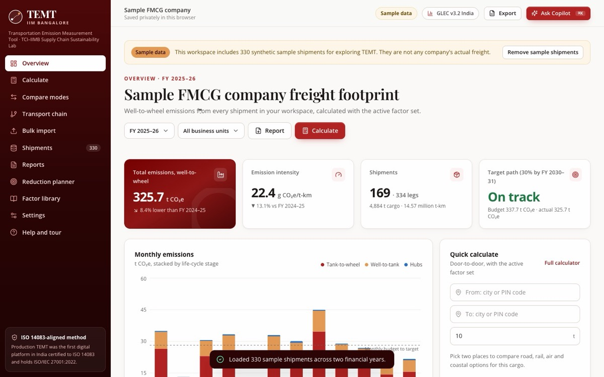
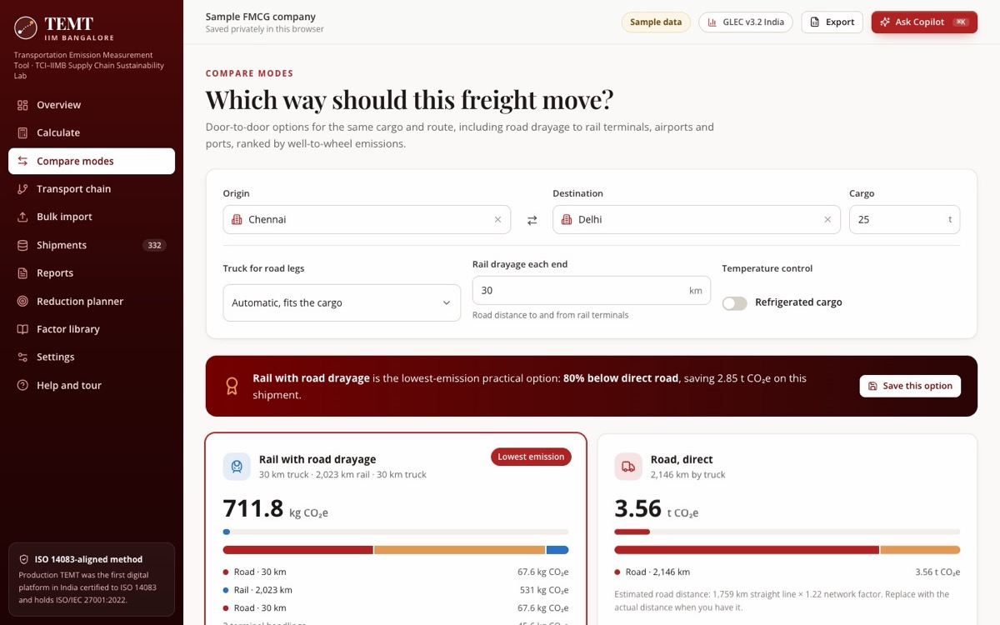
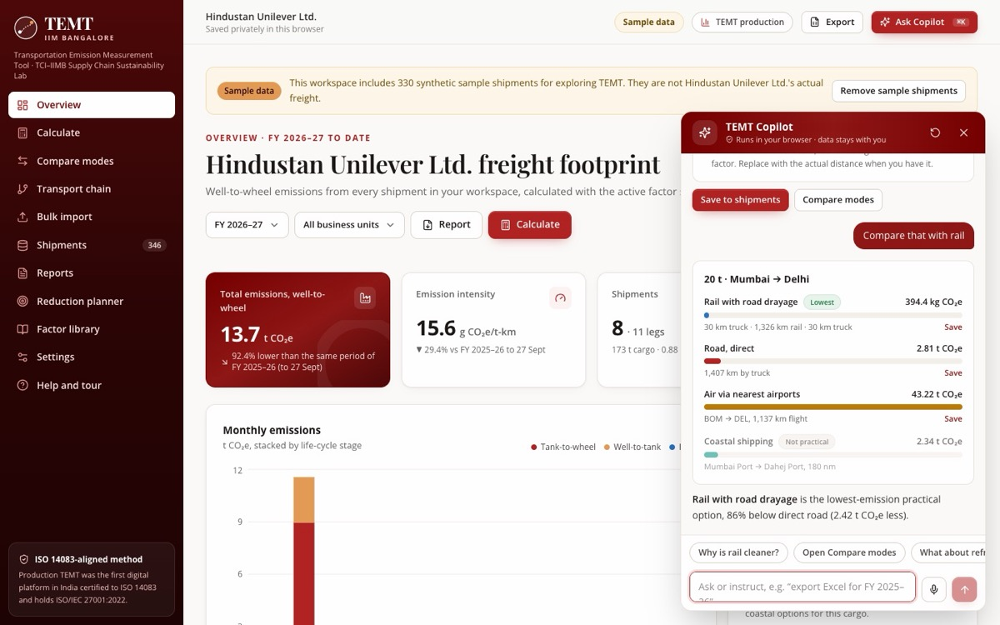

# TEMT · Transportation Emission Measurement Tool

A working freight-emissions product for India's listed companies, rebuilt for the TCI–IIMB Supply Chain Sustainability Lab at IIM Bangalore. It calculates well-to-wheel emissions for road, rail, air, sea and inland-waterway shipments with an ISO 14083-aligned method and India-specific factors, then turns them into dashboards, reports and reduction plans.

**[Live product](https://temt-iimb-sample.onrender.com/app/) · [Landing page](https://temt-iimb-sample.onrender.com) · [Video tour](https://temt-iimb-sample.onrender.com/tour/) · [Methodology](https://temt-iimb-sample.onrender.com/methodology/)**



## What the product does

| Area | What you can do |
| --- | --- |
| Calculate | Door-to-door emissions for one shipment by road (7 vehicle classes; diesel, petrol, CNG or electric), rail, air, sea (trade lane or vessel type), inland waterway and courier/PTL. Distance, fuel and energy methods. Cities, 19,000+ PIN codes, 1,200+ airports and 62 ports. |
| Compare modes | Road, rail with drayage, air and coastal options for the same cargo, with practicality checks and savings. |
| Transport chain | Multi-leg chains with hubs and terminals (ISO 14083 transport chain elements), five templates. |
| Bulk import | TEMT Excel/CSV template, six file formats from earlier TEMT versions and GST e-way bill JSON, with row-level validation. |
| Shipments ledger | Search, filter, edit, duplicate and audit every shipment, with a full calculation trace per leg. |
| Dashboard and reports | Monthly trend by life-cycle stage, mode, business unit, lanes, GHG Protocol scope, data quality, targets and year-on-year comparison. |
| Exports | PDF report, Excel workbook, Word report (all three with the BRSR Principle 6 mapping), Power BI pack (star schema, DAX, theme), CSV and JSON. |
| Reduction planner | Air-to-road and road-to-rail shift, consolidation, electric trucks and load-factor scenarios, measured against a target. |
| Factor library | TEMT's India-specific emission factors with sources and versions, and the GLEC Framework v3.2 defaults as an optional comparison. |
| Copilot | Plain-English and voice assistant in the browser: calculates, compares, saves, analyses, runs what-ifs, exports and explains. Optional local model via Ollama or LM Studio. |
| Guided tour | A 14-step in-product walkthrough on sample data. |
| Account (optional) | Sign in to sync the workspace across devices, keep a report history, manage sessions, and download or delete your data. |

Workspaces are stored in the browser (IndexedDB) and work without an account. Signing in (at `/signin/`) keeps a synced copy on the server (Postgres on Supabase), with scrypt-hashed passwords, HttpOnly session cookies, CSRF checks, parameterised SQL and sign-in lockout. Sample workspaces for four sectors are synthetic and labelled as such everywhere, including on exported reports.

TEMT was the first platform in India certified to ISO 14083 (December 2024) and holds ISO/IEC 27001:2022. Those certifications apply to the certified platform and its stated scope; this rebuild follows the same method and factors.

| | |
| --- | --- |
|  |  |

## Run locally

Use Node 22.23.2 and npm.

```sh
npm ci
cp apps/web/.env.example apps/web/.env.local
npm run dev
```

The web app runs at http://localhost:3000 and the API at http://localhost:3001. No API key, database or login is required.

```sh
npm test        # engine, API and web tests
npm run check   # type checks
npm run build   # calculator, API and static web build
```

## Architecture

| Workspace | Purpose |
| --- | --- |
| `packages/calculator` | Shared TypeScript engine: factor library, ISO 14083 leg and hub calculations, distance estimation, sea-lane routing, Zod schemas |
| `apps/web` | Next.js static export with React 19, Tailwind CSS v4, Recharts, the Copilot and all exports |
| `apps/api` | Express API using the same engine: calculation (`/api/v2/factors`, `/api/v2/calculate`), accounts and sessions (`/api/auth/*`, `/api/account/*`), workspace sync (`/api/workspace`) and report history (`/api/reports`). Postgres via `DATABASE_URL`, otherwise Node's built-in SQLite |
| `video` | Remotion project and Playwright scripts for the product tour and end-to-end checks |

Each calculated leg records what ISO 14083 asks a report to state: transport activity, distance type (SFD or GCD), method, emission intensity, factor source and data type, so every number in a report traces back to an input and a published factor.

## Deployment

[render.yaml](render.yaml) deploys the static site to Render's CDN and the API as a free Node service; the site proxies `/api` to the API so sessions stay first-party. Both deploy from `main` after GitHub Actions passes. Set `DATABASE_URL` to the Supabase session-pooler connection string on the API to keep accounts across restarts. See the [deployment guide](docs/deployment.md).

## Sources

- TEMT's emission factors (TCI–IIMB Supply Chain Sustainability Lab), ISO 14083:2023, GHG Protocol Scope 3 guidance, CEA CO₂ Baseline Database V21.0 and, where TEMT has no value of its own, the GLEC Framework v3.2 (Smart Freight Centre). Full register: [docs/SOURCES.md](docs/SOURCES.md).
- [TEMT at IIM Bangalore](https://www.iimb.ac.in/node/11590) · [TCI–IIMB Supply Chain Sustainability Lab](https://www.iimb.ac.in/tci-supply-chain-sustainability-lab)

The original Apache 2.0 licence is preserved. Fonts retain their licences in `apps/web/public/fonts`.
